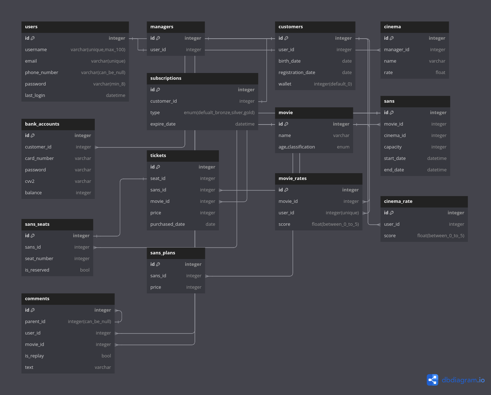

# Cinema Ticket

This is a project for Quera bootcamp course in which a reservation system is based on CLI.
For more information about the design of this system, we suggest you check the following ERD:




## Project localization procedure (for developers)
1 - Clone project

2 - Create virtualenv and install project dependencies from `requirements.txt`
```bash
python -m virtualenv venv
source venv/bin/activate
pip install -r requirements.txt
```

3 - Make a copy of `sample.env` and change the variables
```bash
cp sample.env .env
```

4 - Run the following command to apply migrations to the database
```bash
alembic upgrade head
```